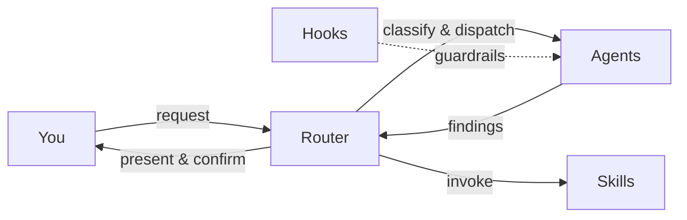
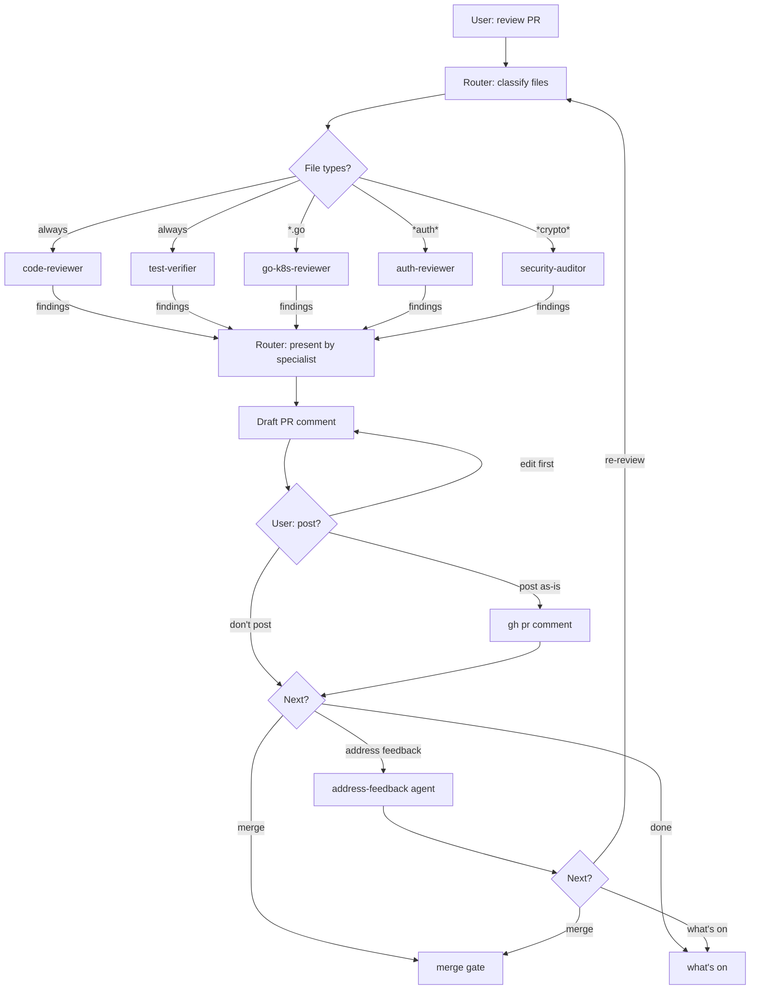
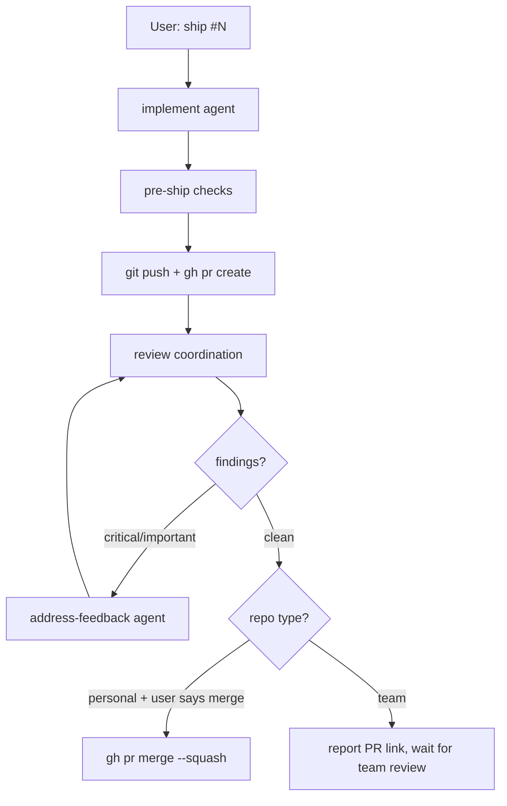
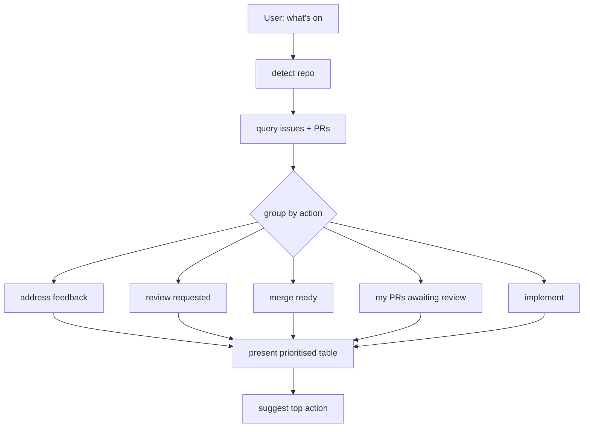

# clawdio

Claude Code plugin for SDLC automation. A router agent dispatches to specialist subagents based on the task. Skills provide cross-cutting workflow knowledge. Hooks enforce guardrails.

The premise: the bottleneck is never orchestration infrastructure -- it's agent reliability. This plugin invests in good agents, skills, and hooks that work natively in Claude Code, replacing a [custom Go orchestrator](https://github.com/jasonmadigan/clawdio) that was over-built for what it did.

## Install

```bash
# add the marketplace
claude plugin marketplace add jasonmadigan/clawdio

# install the plugin (user scope, available in all repos)
claude plugin install clawdio
```

For local development:

```bash
claude --plugin-dir /path/to/clawdio

# or with a specific agent and permissions
claude --plugin-dir ~/Work/clawdio --dangerously-skip-permissions --agent clawdio:router
```

Reload after changes without restarting Claude:

```
/reload-plugins
```

## Dependencies

Install these separately -- clawdio agents and skills reference them.

### Plugins

| Plugin | Install | What it provides |
|-|-|-|
| [agent-skills](https://github.com/addyosmani/agent-skills) | `claude plugin marketplace add addyosmani/agent-skills && claude plugin install agent-skills` | Security hardening, code review, TDD, debugging, git workflow, spec-driven development |
| [dev-team-plugin](https://github.com/kuadrant/dev-team-plugin) | `claude plugin marketplace add kuadrant/dev-team-plugin && claude plugin install kdt` | Design docs, feature lifecycle, Go PR review, doc verification, external contribs |
| [playwright](https://github.com/anthropics/claude-plugins-official) | `claude plugin install playwright` | Browser automation for UI test verification |

Clawdio handles SDLC orchestration (router, specialists, shipping). agent-skills handles cross-cutting development practices. kdt provides design doc workflows and feature lifecycle management. The router dispatches to all three.

### CLI tools

| Tool | Purpose | Used by |
|-|-|-|
| [`gh`](https://cli.github.com/) | GitHub issue/PR operations | implement, review, triage, refine, address-feedback, what-next, ship |

Must be authenticated (`gh auth login`).

### MCP servers

| Server | Purpose | Used by |
|-|-|-|
| GitHub MCP | Issue/PR comments, review threads | address-feedback |
| [Atlassian MCP](https://github.com/sooperset/mcp-atlassian) | Jira issue search, creation, updates | what-next, triage, router |

Install Atlassian MCP via `claude mcp add atlassian -s user -e JIRA_URL=https://your-site.atlassian.net -e JIRA_USERNAME=you@company.com -e JIRA_API_TOKEN=your-token -- uvx mcp-atlassian --jira-url https://your-site.atlassian.net`. Requires `uv` installed.

## How it works

Talk to the **router** agent. It classifies your request and dispatches the right specialist.



### Review flow

The router owns the review fanout. Subagents can't spawn sub-subagents, so the router dispatches all specialists in parallel.



### Ship flow

Full lifecycle from issue to merged PR.



### What's on flow

Scoped to the current repo by default.



### Typical commands

**"What's on?"** -- invokes the `what-next` skill. Queries GitHub for issues, PRs, and feedback in the current repo. Returns a prioritised table.

**"Ship #42"** -- invokes the `ship` skill. Implements, pushes, creates PR, self-reviews, fixes findings, reports back.

**"Review this PR"** -- classifies files, dispatches specialist reviewers in parallel, collects findings, drafts PR comment.

**"Triage this issue"** -- dispatches the triage agent. Assesses readiness, recommends workflow (implement, refine, split, or human review).

**"This issue is vague"** -- dispatches the refine agent. Produces a structured spec with testable acceptance criteria.

## Agents

| Agent | Purpose |
|-|-|
| router | Task intake, classification, delegation. Coordinates review fanout. Never writes code. |
| implement | Takes a well-defined issue, writes code, runs tests, commits |
| code-reviewer | General code quality: correctness, readability, architecture, naming |
| security-auditor | Security review: injection, auth bypasses, secrets, crypto, OWASP |
| go-k8s-reviewer | Go idioms, concurrency, controller patterns, CRD conventions, RBAC |
| auth-reviewer | OAuth2/OIDC flows, token handling, policy evaluation, standards compliance |
| triage | Assesses issue readiness, labels, prioritises, recommends workflow |
| refine | Turns vague issues into implementable specs with acceptance criteria |
| address-feedback | Reads PR review comments, categorises, fixes, reports what needs human input |
| release-notes | Generates grouped release notes between git tags |
| test-writer | Finds coverage gaps, writes targeted tests matching project patterns |
| test-verifier | Verifies PR test plans: runs tests, checks criteria, drives browser for UI checks |
| docs | Writes and updates documentation. Verifies every example and path. |

## Skills

| Skill | Trigger | Purpose |
|-|-|-|
| what-next | "what's on?", "what next?" | Scans GitHub for issues, PRs, and feedback across repos |
| ship | "ship #42" | Full lifecycle: implement > push > PR > self-review > fix |
| pr-description | Creating a PR | PR body template: summary, linked issue, test evidence |

## Hooks

| Hook | Trigger | Purpose |
|-|-|-|
| block-env-writes | Before Write/Edit | Blocks writes to `.env`, credentials, `.pem`, `.key` files |
| format-on-save | After Write/Edit | Runs project formatter if configured (prettier, gofmt, clang-format) |
| lint-on-edit | After Write/Edit | Runs project linter if configured (eslint, golangci-lint) |

## Structure

```
agents/           subagent definitions (one .md per agent)
skills/           on-demand skills (SKILL.md per directory)
hooks/            lifecycle hooks (hooks.json)
references/       supporting docs agents can read
docs/             architecture decisions and project context
.claude-plugin/   plugin manifest and marketplace config
```

## Personalisation

The go-k8s-reviewer and auth-reviewer ship with generic definitions suitable for any Go/K8s or auth project. For domain-specific review depth, override them with personal versions in `~/.claude/agents/` -- personal agents take precedence over plugin agents.

Personal agent overrides stay out of this repo. They're your competitive advantage, not a shared concern.

## Development

See [docs/contributing.md](docs/contributing.md) for how to write agents, skills, and hooks.

Edit, test locally with `claude --plugin-dir .`, push, then `claude plugin update clawdio@jasonmadigan-clawdio`.

## Design

See [docs/architecture.md](docs/architecture.md) for the full design rationale, including why this is a plugin and not an orchestrator, the three-tier primitive location model, and future Agent SDK migration path.

See [docs/grill-findings.md](docs/grill-findings.md) for the structured interview that informed these decisions.
